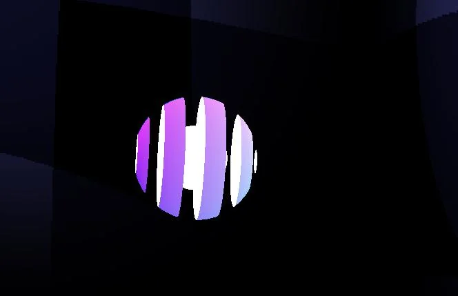

# Metal Sketch Dojo

## Graphics and animations with the Apple Metal API

This project served as playground for me to explore Swift and the Metal rendering API. It has no external libraries, all animations and graphics are written from scratch. Coming from web development and WebGL / WebGPU, I have always had interest in expanding my skillset and developing for iOS.

Sadly, Apple refused to approve this app for the App Store, as it really has no concrete purpose and minimal functionality, outside of serving as a demonstration of animations and different rendering techniques. I don't mind it (and honestly was half expecting it anyway), since I learned a lot from this project.

That being said, this app can't be downloaded on the App Store, but you can always run it on real hardware by cloning this repo and running it in Xcode.

### 1. Point Light Casters

The visuals of this demo are borrowed from [this Threejs example](https://threejs.org/examples/?q=point#webgl_shadowmap_pointlight). I really like the interplay of shadows and lights so was curious to implement it via the Metal API.

It renders a cube with front face culling enabled and two shadow casters represented by cut off spheres.

#### 1.1. Different spheres, same underlying shaders: Metal function constants

Metal has no preprocessor directives, rather it uses [function constants](https://developer.apple.com/documentation/metal/mtlfunctionconstantvalues) to permutate a graphics or a compute function. Since Metal shaders are precompiled, different permutations do no result in different binaries, rather things are lazily turned on or off conditionally upon shader pipeline creation.

The sphere below is three drawcalls, using three different pipelines backed by the same vertex and fragment shaders. Each pipeline permutation has different inputs / outputs and codepaths toggled by function constants:

1. Front part of the sphere: has a gradient as color and is cut-off along the Y axis
2. Back side of the sphere: has a solid white as color and is cut-off along the Y axis
3. Center part: another sphere with a solid white as color and no cut-off

#### 1.2. Cube shadows via depth cubemaps in a single drawcall

Point shadow casting is straightforward and hardly a new technique: we place a camera where the light should be, orient it to face left, right, top, bottom, forward and backwards, rendering in the process each of these views into the sides of a cube depth texture. We then use this cube texture in our main fragment shader to determine which pixels are in shadow and which ones are not. Nothin' that fancy.

The Metal API however makes things interesting by **allowing us to render all 6 sides of the cube texture in a single draw call**. It does so by utilising [layer selection](https://developer.apple.com/documentation/metal/render_passes/rendering_to_multiple_texture_slices_in_a_draw_command). It allows us to render to multiple layers (slices) of a textture array, 3d texture or a cube texture. We can choose a destination slice for each primitive in the vertex shader. So each sphere is rendered 6 times with a single draw call, each render using a different camera orientation and storing its result in the appropriate cube texture side.
